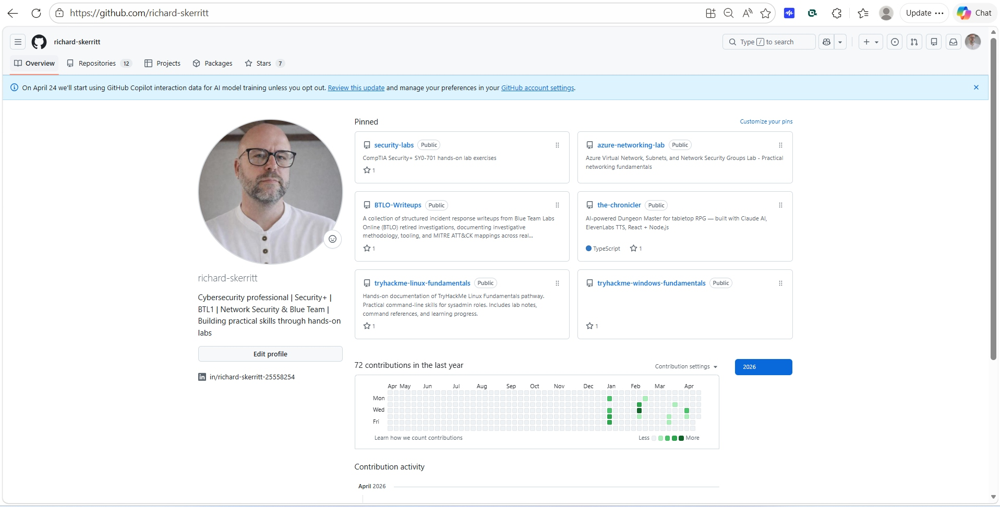
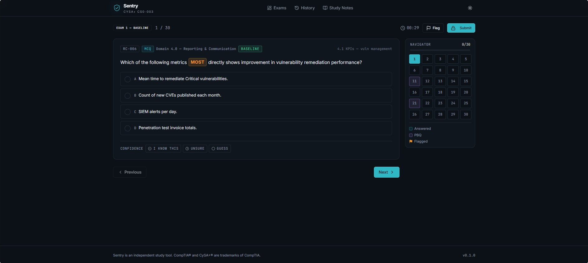
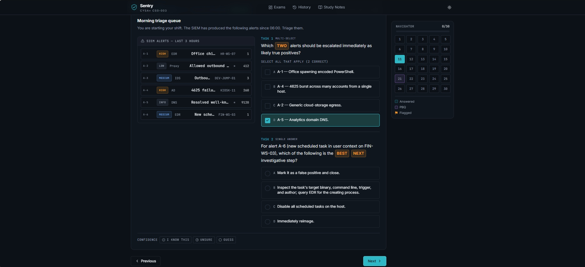
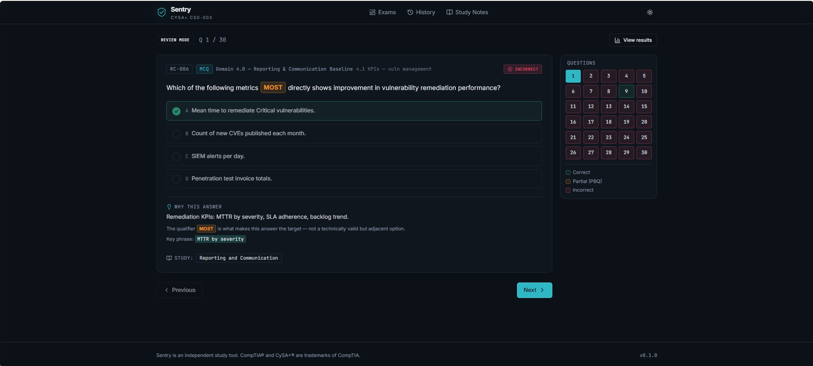
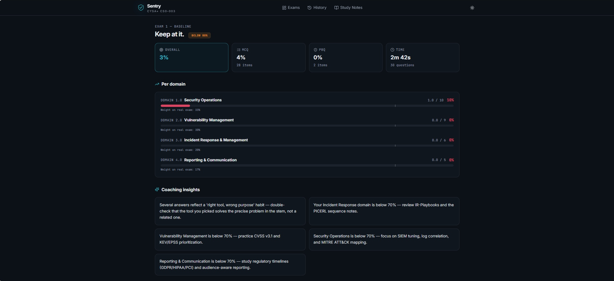
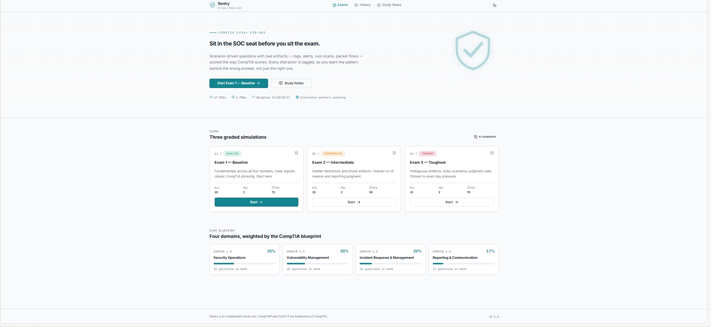

<div align="center">



# Sentry — CySA+ CS0-003 Exam Simulator

**Sit in the SOC seat before you sit the exam.**

A scenario-driven practice environment for the CompTIA CySA+ (CS0-003) exam, built to feel like a real SOC shift rather than a flashcard deck. Every question is an original, hand-authored scenario modelled on the published CompTIA exam objectives. Every wrong answer teaches a reusable pattern, not just a fact.

[Features](#features) · [Screenshots](#screenshots) · [Getting Started](#getting-started) · [Project Structure](#project-structure) · [Disclaimer](#disclaimer)

</div>

---

## Why Sentry

Most CySA+ prep resources test recall. Sentry tests **judgment**:

- **Scenario stems over trivia.** Every MCQ is a miniature SOC situation — an alert to triage, a log to interpret, a stakeholder to brief.
- **Qualifier-aware.** Words like **FIRST**, **BEST**, **NEXT**, **MOST**, **LEAST**, **TWO**, and **THREE** are highlighted inline so you can't misread the question's intent.
- **Tagged distractors.** Every wrong answer is classified by the pattern it represents — right-action-wrong-phase, right-tool-wrong-purpose, valid-but-not-best, scope-mismatch, policy-vs-ops — so review mode teaches you the *shape* of the mistake.
- **PBQ-first workspace.** Performance-based questions use a genuine split view with an artifact pane (SIEM alerts, packet flows, vulnerability scans) and interactive sequencing / ranking — not a text paragraph and four radio buttons.
- **Coaching, not just scoring.** Results surface per-domain weaknesses weighted against the real blueprint, plus targeted coaching insights pointing you at the right study notes.

## Features

### Exam engine

- **67 original MCQs + 6 interactive PBQs**, authored against the published CS0-003 exam objectives
- **Three graded exams** — Baseline, Intermediate, Toughest — with a deliberate difficulty curve
- **CompTIA blueprint weighting** — 33 % Security Operations · 30 % Vulnerability Management · 20 % Incident Response · 17 % Reporting & Communication
- **No "all of the above" / "none of the above"** — every option forces a real judgement call
- **Deterministic exam generation** — same exam seed, same question set, so you can retake and compare

### Runner

- Countdown timer, flag-for-review, jump-to navigator sidebar
- **Confidence tagging** per item (I know this · Unsure · Guess) feeds into post-exam coaching
- Split-view PBQ workspace with artifact pane + interactive task panel
- Submit-confirmation overlay summarising flagged and unanswered items

### Review & analytics

- Per-question coaching card: verdict badge, qualifier callout, the distractor trap triggered, the key phrase that made the correct answer correct, and a cross-link to the relevant study note
- Results dashboard with overall / MCQ / PBQ splits, per-domain bars with an 80 % benchmark line, and pattern-frequency readout
- **History page** listing every attempt with duration, score, and one-click return to review

### Study notes

Fourteen in-app curriculum pages covering:

SIEM & Log Analysis · Threat Intelligence & Hunting · Vulnerability Management · Incident Response Lifecycle · Digital Forensics & Malware Analysis · Network Security Monitoring · Endpoint Security & EDR · Reporting & Communication · Cloud Security Operations · MITRE ATT&CK Reference · Windows Event ID Cheatsheet · CVSS v3.1 Guide · IR Playbooks by Attack Type · Regulatory Compliance Cheatsheet

### Polish

- Dark theme by default (SOC-tool aesthetic) with a light-mode toggle
- SQLite-backed attempt persistence via Drizzle ORM — your history survives restarts
- Clean typography, generous whitespace, keyboard-friendly navigation

## Screenshots

**Home — dark mode**


**Exam runner — MCQ with qualifier highlighting**



**PBQ workspace — SIEM triage split view**



**Review mode — coaching on a completed item**



**Results — per-domain analytics and coaching insights**



**Home — light mode**



## Getting Started

### Prerequisites

- Node.js 20+
- npm 10+

### Install and run

```bash
git clone https://github.com/richard-skerritt/sentry-cysa-cs0-003.git
cd sentry-cysa-cs0-003
npm install
npm run dev
```

The dev server starts Express and Vite on the same port (default `5000`). Open [http://localhost:5000](http://localhost:5000) and start Exam 1.

### Production build

```bash
npm run build
NODE_ENV=production node dist/index.cjs
```

Builds the client bundle and starts the production Express server on port 5000.

## Project Structure

```
sentry-cysa-cs0-003/
├── client/src/
│   ├── components/        # AppShell, BrandMark, StemText, UI primitives
│   ├── content/           # 14 curriculum markdown files (study notes)
│   ├── data/
│   │   ├── bank.ts        # Question bank + exam generator
│   │   └── pbqs.ts        # PBQ definitions
│   ├── pages/             # Home, Runner, Review, Results, History, Notes
│   ├── App.tsx            # Hash-based routing
│   └── index.css          # Design tokens, dark/light themes
├── server/
│   ├── routes.ts          # /api/attempts REST endpoints
│   ├── storage.ts         # Drizzle storage interface
│   └── index.ts           # Express bootstrap
├── shared/
│   └── schema.ts          # Drizzle schema + Zod validators (attempts table)
├── docs/screenshots/      # README assets
└── package.json
```

### Tech stack

- **Frontend:** React 18 · TypeScript · Vite · Tailwind CSS v3 · shadcn/ui · wouter (hash routing) · TanStack Query
- **Backend:** Express 4 · better-sqlite3 · Drizzle ORM · Zod
- **Content:** Markdown study notes rendered with `marked`

## Authoring New Questions

All question content lives in `client/src/data/`:

- `bank.ts` — MCQ objects with `stem`, `options`, `correct`, `qualifier`, `domain`, `difficulty`, `distractorPatterns`, and `explanation`
- `pbqs.ts` — PBQ objects with an `artifact` block and an ordered list of `tasks` (single-select, multi-select, sequence, or rank)

Each question should:

1. Be an original scenario you could plausibly encounter on a real SOC shift
2. Have a visible qualifier (`FIRST`, `BEST`, `NEXT`, `MOST`, `LEAST`, `TWO`, `THREE`) that governs which option is correct
3. Tag each distractor with the pattern it represents so review mode can coach against it
4. Cross-link to the relevant `content/*.md` study note in the `explanation.studyRef` field

See [CONTRIBUTING.md](./CONTRIBUTING.md) for the full authoring style guide.

## Roadmap

- [ ] Expand the MCQ bank beyond 100 items
- [ ] Add 4 more PBQs (email header forensics, cloud IAM triage, memory analysis, threat-intel pivot)
- [ ] Per-domain practice mode (drill a single domain without time pressure)
- [ ] Export attempt history as CSV / PDF
- [ ] Accessibility audit (WCAG 2.1 AA)

## Disclaimer

Sentry is an **independent, non-commercial study tool**. It is not affiliated with, endorsed by, sponsored by, or otherwise officially connected with CompTIA. CompTIA®, CySA+®, and the CS0-003 objectives are trademarks or registered trademarks of CompTIA Properties, LLC.

All practice questions and performance-based scenarios in this repository are **original content written by the author**, modelled on the publicly available [CompTIA CySA+ CS0-003 Exam Objectives](https://www.comptia.org/certifications/cybersecurity-analyst). No question text, answer keys, or other material from the official exam, official CompTIA practice tests, or any third-party copyrighted study product has been copied, paraphrased, or otherwise reproduced.

Sentry is intended to supplement — not replace — official CompTIA study resources. Passing Sentry is not a guarantee of passing the real exam.

## License

[MIT](./LICENSE) © 2026 [@richard-skerritt](https://github.com/richard-skerritt)

---

<div align="center">
<sub>Built with care by <a href="https://github.com/richard-skerritt">@richard-skerritt</a> — a cybersecurity practitioner who wanted prep that felt like the job.</sub>
</div>
